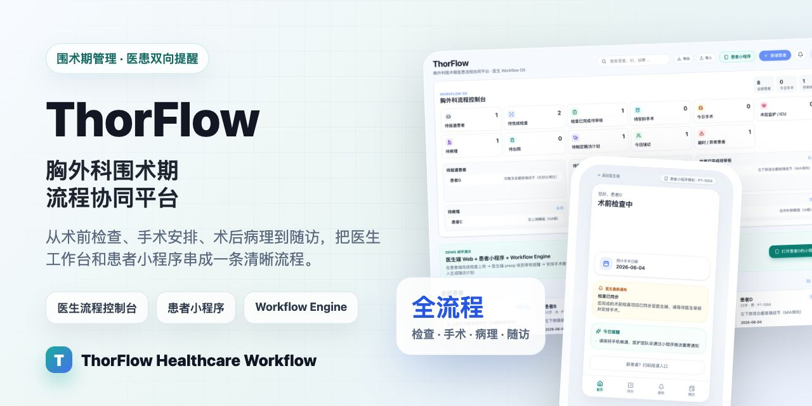
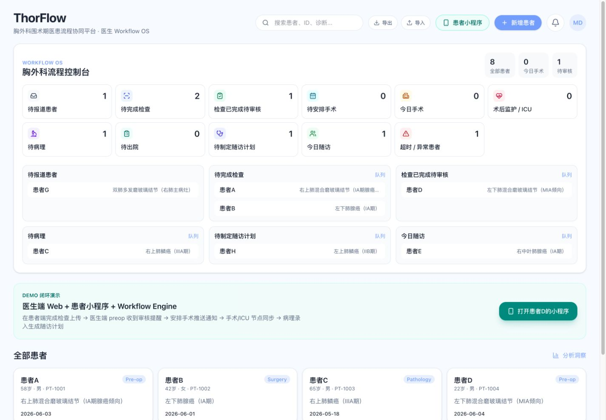
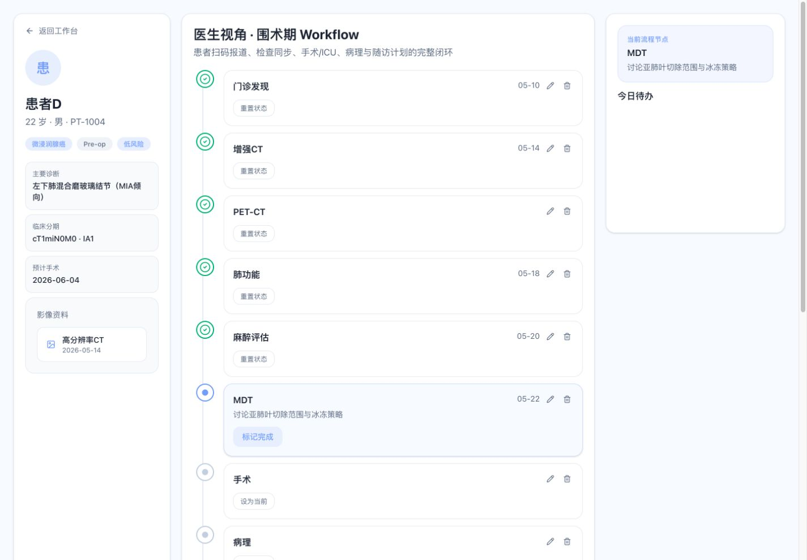
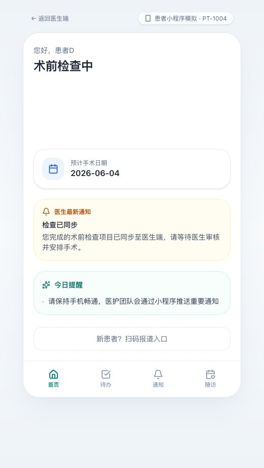
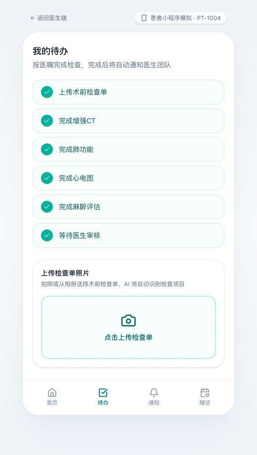

# ThorFlow

胸外科围术期医患流程协同平台

[](https://github.com/dongmingzh/thorflow/actions/workflows/ci.yml)
[](https://thorflow.netlify.app)
[](LICENSE)

**[Live Preview / 在线体验](https://thorflow.netlify.app)**



ThorFlow 想解决一个很具体的问题：胸外科患者从门诊发现、术前检查、安排手术、进入手术室、术后监护、病理结果到随访，过程很长，信息分散在医生、护士、患者、家属、检查单、微信群和医院系统之间。只要一个节点没人提醒，就容易拖慢流程，患者也会焦虑。

这个项目展示的是一套围术期流程协同产品：如果把这些环节整理成一条清晰的数字化流程，医生端可以像调度台一样看全局，患者端可以像小程序一样知道自己下一步该做什么，中间由 Workflow Engine 自动生成任务、通知和随访计划。

> 当前版本为本地产品原型，不连接真实医院系统、真实微信小程序或生产 AI 服务。所有患者信息都是匿名示例数据，例如“患者A、患者B”。

## 一句话介绍

ThorFlow 是给胸外科团队用的“围术期流程控制台”：  
医生看得见每个患者卡在哪一步，患者收得到下一步提醒，系统自动把检查、手术、病理、随访串成闭环。

## 界面预览

### 医生端：胸外科流程控制台

医生打开 `/dashboard` 后，不是看到一张普通患者表，而是看到各个流程池：待报道、待检查、待审核、待安排手术、今日手术、ICU、待病理、待随访、超时异常等。



### 医生端：患者详情与围术期 Timeline

进入患者详情页后，左侧是基础信息，中间是完整围术期 timeline，右侧是当前待办和关键操作。医生可以标记进入手术室、手术完成、转入 ICU、回病房、录入病理并生成随访计划。



### 患者端：手机小程序模拟

患者看到的是一个更温和、更清楚的小程序界面。它不会把复杂医学流程直接丢给患者，而是告诉患者：现在处于什么阶段、下一步做什么、医生有什么新通知。

<p>
  
  
</p>

## 它能帮医生解决什么问题？

### 1. 少靠人脑记流程

传统流程里，医生和护士经常要靠微信群、纸质单、口头交接来记患者进度。ThorFlow 把每个患者放进对应流程池，让团队一眼知道谁还没报道、谁检查没做完、谁已经等医生审核、谁今天手术、谁还没录病理。

### 2. 少漏关键节点

胸外科围术期常见漏点包括：检查做完但医生不知道、手术安排后患者没收到清晰通知、术后 ICU/回病房状态没有同步、病理出来后忘记生成随访计划。ThorFlow 用 timeline、任务和通知把这些节点串起来。

### 3. 让患者更安心

患者最焦虑的往往不是“流程复杂”，而是不知道自己现在到哪一步、还差什么、什么时候手术、下一次复查什么时候。患者端小程序用简单语言告诉患者下一步行动，减少反复打电话和群里追问。

### 4. 适合做科室路演和融资展示

这个项目不是普通后台页面，而是围绕“医生端 + 患者端 + 工作流引擎”的闭环体验设计，适合展示胸外科专病管理、围术期数字化、医疗 AI SaaS、院内流程改造等方向。

## 产品讲述的完整流程

1. 患者扫码报道
2. 填写基本信息
3. 上传术前检查单
4. 系统模拟 AI 识别检查项目
5. 患者逐项完成增强 CT、肺功能、心电图、血常规、凝血、肝肾功能、麻醉评估等检查
6. 医生端收到“检查已完成，等待审核”的提醒
7. 医生安排手术日期
8. 患者端收到手术通知
9. 医生标记进入手术室、手术完成、转入 ICU/监护室、转回病房
10. 患者端同步收到状态通知
11. 医生录入病理类型、分期和治疗建议
12. 系统生成随访计划
13. 患者端看到复查时间表和医生提醒

## 主要页面

| 页面 | 给谁看 | 说明 |
| --- | --- | --- |
| `/dashboard` | 医生 / 管理者 | 胸外科流程控制台，查看所有 workflow pools |
| `/dashboard/preop` | 医生 | 查看术前检查完成情况和审核提醒 |
| `/dashboard/surgery` | 医生 | 查看今日手术排班和手术状态 |
| `/dashboard/pathology` | 医生 | 录入病理、分期和辅助治疗建议 |
| `/dashboard/followup` | 医生 | 查看今日随访和 AI 生成的复查提醒 |
| `/patient/PT-1004` | 医生 | 单个患者详情、timeline、AI 分析、关键操作 |
| `/patient-mini` | 患者 | 小程序首页，查看当前阶段和下一步 |
| `/patient-mini/tasks` | 患者 | 上传检查单并完成检查任务 |
| `/patient-mini/notifications` | 患者 | 查看手术、ICU、病理、随访通知 |
| `/patient-mini/followup` | 患者 | 查看随访计划和复查安排 |

## 推荐演示路径

如果你要给医生、科室主任或投资人展示，建议按这个顺序讲：

1. 打开 `/dashboard`：先展示医生端全局流程池
2. 打开 `/patient-mini`：展示患者看到的当前阶段和医生通知
3. 打开 `/patient-mini/tasks`：展示上传检查单和 AI 识别检查项目
4. 打开 `/dashboard/preop`：展示医生端收到术前检查完成提醒
5. 打开 `/patient/PT-1004`：展示患者详情、timeline 和关键操作
6. 打开 `/dashboard/pathology`：展示录入病理和分期
7. 打开 `/patient-mini/followup`：展示患者端看到随访计划

## 项目由三部分组成

### 医生端

医生端是 Web / Desktop Workflow OS，重点不是“登记患者”，而是“控制流程”。它展示每个患者在哪个池子里、谁需要处理、哪个节点超时、下一步该由谁动作。

### 患者端

患者端是手机小程序模拟。它不追求信息密度，而是追求清楚、温和、可执行：今天做什么、还差什么、医生说了什么、什么时候复查。

### Workflow Engine

Workflow Engine 是本地 TypeScript 逻辑，负责模拟：

- 患者状态流转
- timeline 事件生成
- 患者端通知生成
- 检查单识别后生成任务
- 根据病理和分期生成随访计划

现在它使用本地 mock 数据和浏览器存储，后续可以接 Supabase、医院数据库、PACS、EMR 或真实通知系统。

## 如何本地运行

先进入项目目录：

```bash
cd "/Users/zhangdongming/Library/CloudStorage/OneDrive-个人/学习/vibecoding/thorflow"
```

安装依赖：

```bash
npm install
```

启动开发服务：

```bash
npm run dev
```

打开浏览器访问：

```text
http://localhost:3000/dashboard
```

## 常用命令

```bash
npm run dev      # 启动本地开发服务
npm run build    # 检查能否正常生产构建
npm run start    # 运行生产构建后的服务
npm run lint     # 运行 ESLint 检查
```

## 技术栈

- Next.js 16 App Router
- React 19
- TypeScript
- Tailwind CSS 4
- lucide-react
- framer-motion
- 本地 mock data + localStorage 模拟工作流状态

## 目录结构

```text
app/
  dashboard/              医生端流程控制台页面
  patient/[id]/           医生视角的患者详情页
  patient-mini/           患者小程序模拟页面

components/
  dashboard/              医生端看板组件
  patient/                患者详情、timeline、病理、手术操作组件
  patient-mini/           小程序外壳、首页、待办、通知、随访组件
  workflow/               通用工作流页面组件
  providers/              本地 workflow 状态 provider
  ui/                     基础 UI 组件

lib/
  mock-data.ts            匿名示例患者数据
  workflow-engine.ts      状态流转、通知、任务、随访计划逻辑
  workflow.ts             看板与 timeline 辅助逻辑
  followup-templates.ts   随访计划模板
  notification-templates.ts
```

## 数据与合规说明

- 项目中不应提交真实患者信息。
- 当前患者名称统一使用“患者A、患者B、患者C”等匿名格式。
- 电话、住院号、检查结果均为模拟数据。
- 项目不是医疗器械，也不能用于真实临床决策。
- AI 识别、影像预览、通知推送、随访计划均为本地原型能力，尚未接入真实临床系统。

## 后续可以继续升级的方向

- 接入 Supabase 或真实后端数据库
- 增加医生、护士、麻醉、ICU、随访专员等角色权限
- 增加真实消息适配层，如短信、企业微信、医院小程序
- 增加可配置的病理模板和随访规则
- 增加操作审计日志，记录每次状态变更
- 增加一键重置，方便路演、培训和科室展示

## GitHub

```text
https://github.com/dongmingzh/thorflow
```

## License

MIT License. See [LICENSE](LICENSE) for details.
